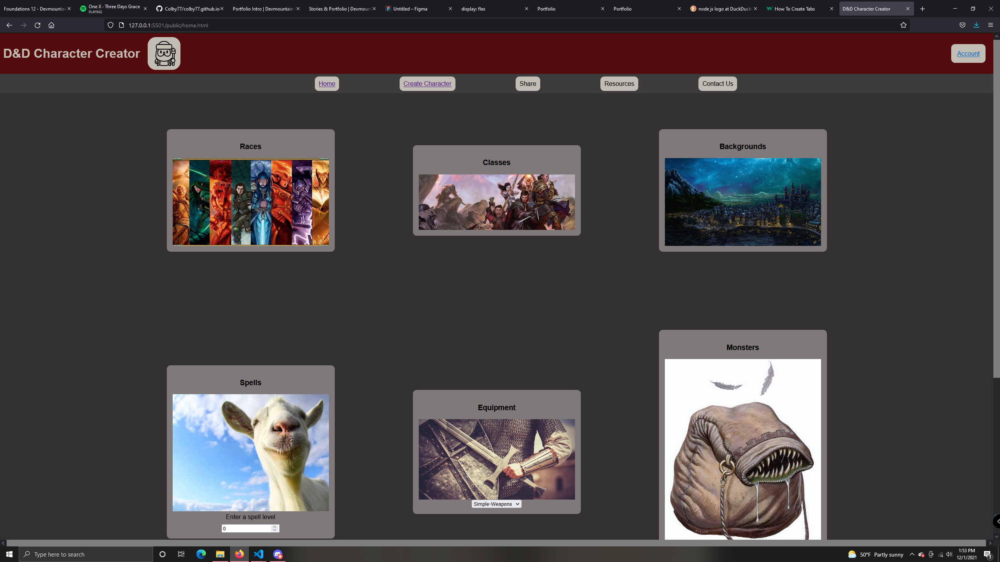
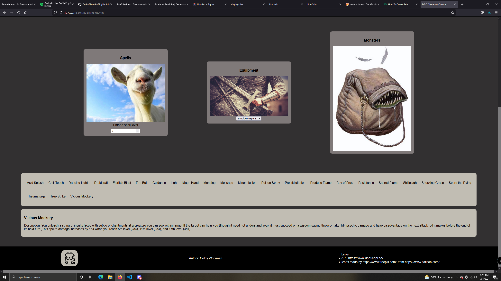
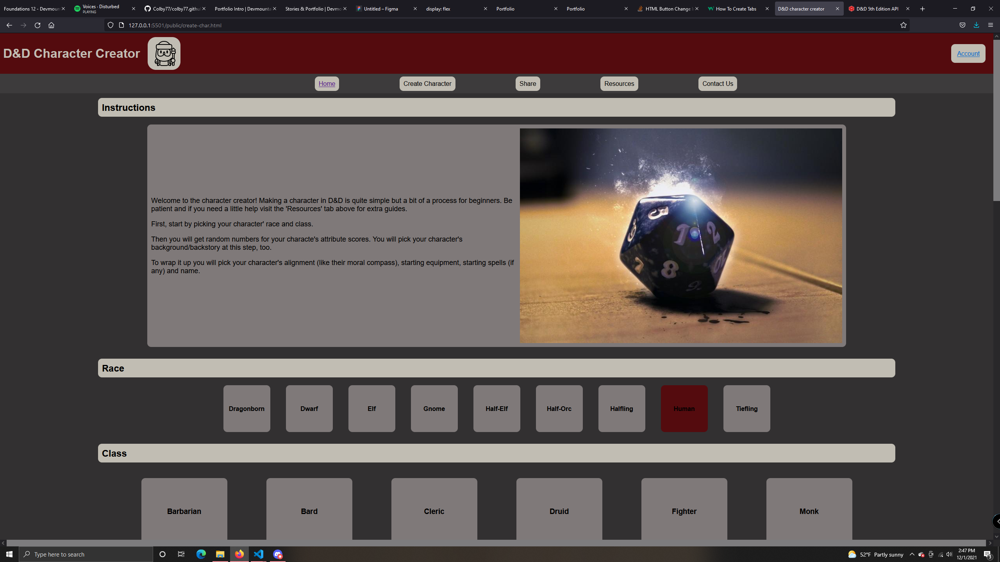
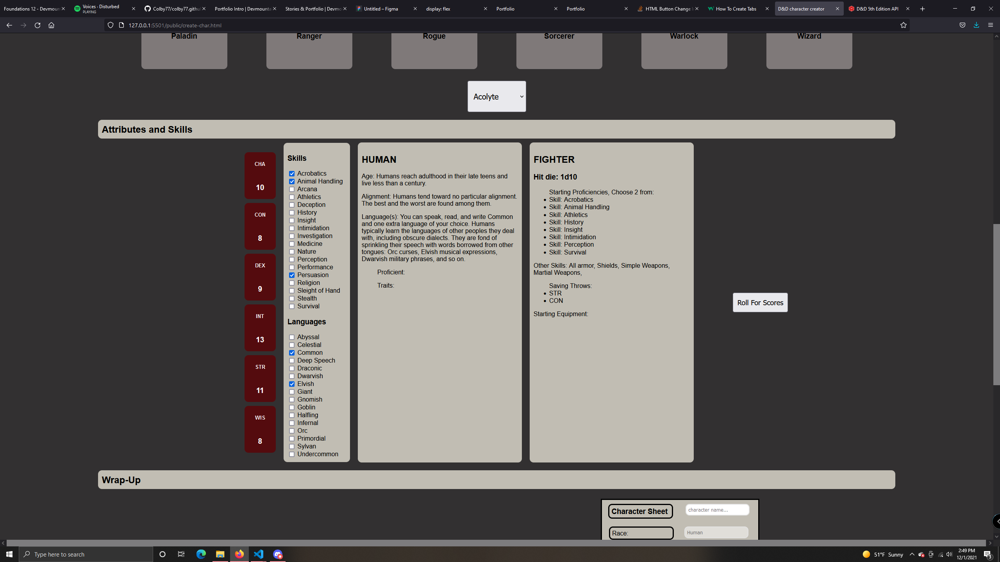
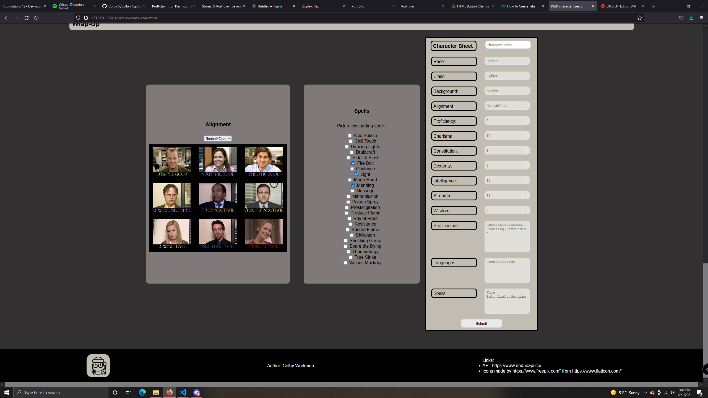

# Dungeons & Dragons Character Creator

## Project Description
I built a simple character creator for D&D, getting information from an API.

On the homepage, you can click the pictures to display options from whatever category you clicked. Clicking on an option then shows specific details and rules about the option. The information is the result from making the request to the API. 

The main function of the site is to make and save characters to a database. Users follow the instructions to make a character and their options are saved to the character sheet form at the bottom of the page. When the character is submitted, it is saved to the database.

Users can also register an account to the database. Their passwords are hashed
with node js bcrypt before they are stored.

## Tech Used
    -HTML/CSS/Javascript
    -Node js
     -Express
     -Axios
     -Cors
     -Bcrypt
     -Sequelize
    -PostgreSQL

## Screenshots

